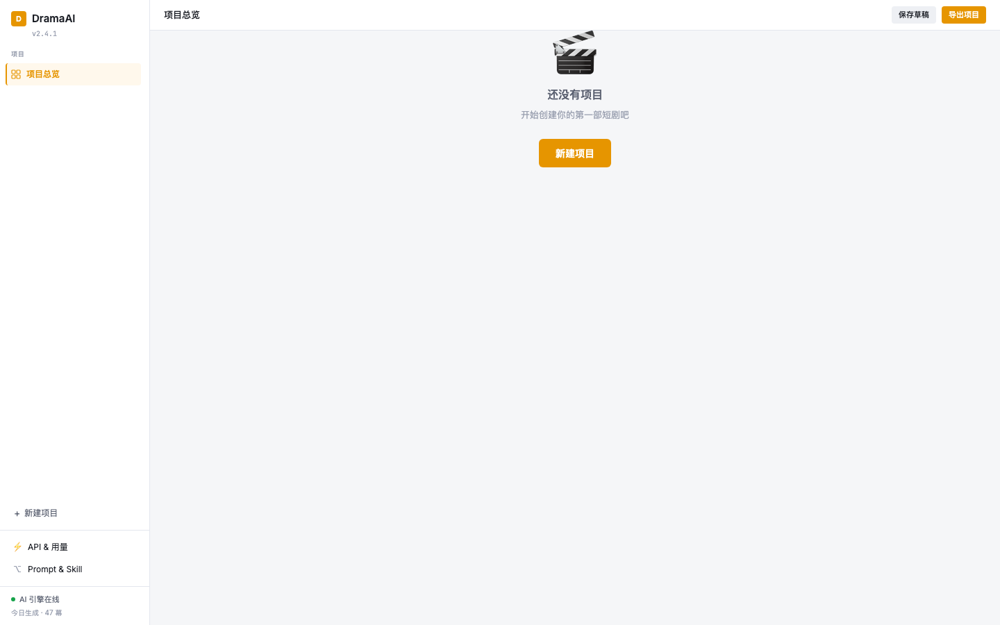

# DramaFlow

**AI 短剧生成提效工具** — 一站式完成短剧的剧本创作、分镜生成、角色管理、场景配音与成片合成。

[](LICENSE)


DramaFlow is an AI-powered production workflow for short dramas: script → storyboard → characters → dubbing → final render, all in one workspace.

> 当前状态：产品原型阶段。**基础 AI 链路已打通**：新建项目 → 一键生成结构化剧本 → 批量生成分镜；**桌面端本地视频合成已可用**（FFmpeg + 系统中文配音 + 字幕）；真实文生图与云端 TTS 正在接入。

## 🖼 界面预览



## ✨ 功能亮点

- **项目总览** — 多项目卡片式管理，进度、筛选、搜索一目了然
- **剧本创作** — 幕次管理、三栏编辑、AI 生成整部剧本、单幕续写与润色（结构化解析落库）
- **分镜生成** — 网格/列表视图、从剧本逐幕批量生成镜头、镜头状态流转
- **角色管理** — 人物档案、声音设置、形象模型
- **场景配音** — 台词批量配音、情绪/语速/音量调节
- **视频合成** — 本地真实合成（FFmpeg H.264 + 中文配音 + 字幕），输出设置、进度跟踪、预览与导出
- **多模型 BYOK** — 自带 API Key 接入 OpenAI 兼容服务（DeepSeek / 通义千问 / 智谱 GLM 等），支持按用途配置不同模型
- **Web + 桌面双形态** — 浏览器直接使用，也可打包为 Electron 桌面应用

## 🚀 快速开始

环境要求：Node.js ≥ 18

```bash
cd dramaflow-app
npm install

# Web 版（浏览器访问 http://localhost:5173）
npm run dev:web

# 桌面版（Electron）
npm run dev

# 生产构建
npm run build

# 桌面打包
npm run build:desktop
```

> 首次打开默认使用「模拟 AI」模式，无需任何配置即可体验完整流程。在侧边栏进入「AI 模型配置」填入你自己的 API Key，即可切换到真实生成。

## 📦 技术栈

| 类别 | 技术 |
|------|------|
| 前端 | React 19 · TypeScript · Vite · Tailwind CSS v4 |
| 状态管理 | Zustand |
| 桌面端 | Electron + electron-builder |
| AI 接入 | OpenAI 兼容 API（可插拔多模型） |

## 🗂 项目结构

```
DramaFlow/
├── dramaflow-app/              # 主应用（唯一正式代码库）
│   ├── electron/               # Electron 主进程与预加载脚本
│   └── src/
│       ├── components/         # 业务组件
│       ├── data/               # 类型、存储、示例数据
│       ├── services/           # AI 服务抽象层（可插拔）
│       └── store/              # Zustand 状态管理
├── archive/                    # 已归档的设计原型与素材
├── DramaFlow-需求文档.md        # 产品需求文档
├── DramaFlow-开发任务计划.md    # 开发路线图
├── LICENSE
└── README.md
```

## 🤖 AI 模型配置

应用通过统一的 [AI 服务抽象层](dramaflow-app/src/services/ai.ts) 按用途路由模型，兼容所有 OpenAI Chat Completions 格式的服务：

支持一键添加 DeepSeek / 通义千问 / 智谱 GLM / OpenAI 预设，填好 Key 后可直接「测试连接」。未配置 Key 时使用内置模拟模型，同样可以体验完整流程。

| 用途 | 说明 |
|------|------|
| 剧本生成 / 润色 | LLM 对话 |
| 分镜 / 人设 / 建议 | LLM 对话 |
| 文生图 | 分镜图、角色形象 |
| 配音 | TTS |
| 视频 | 视频生成 |

**BYOK（自带 Key）**：模型配置保存在本地，不经过任何服务器；请在各服务商官方渠道申请 Key，并妥善保管。

## 🛣 路线图

见 [DramaFlow 开发任务计划](DramaFlow-开发任务计划.md)：开源发布 → 托管服务（账号 / 积分 / 订阅）→ 模板市场 / 团队协作 / 私有化部署。

## 🤝 参与贡献

欢迎提交 Issue 与 PR。请阅读 [CONTRIBUTING](CONTRIBUTING.md) 与 [行为准则](CODE_OF_CONDUCT.md)。

## 📄 许可证

本项目采用 **AGPL-3.0** 开源许可证，详见 [LICENSE](LICENSE)。商业使用 / 托管服务授权请联系项目维护者。
